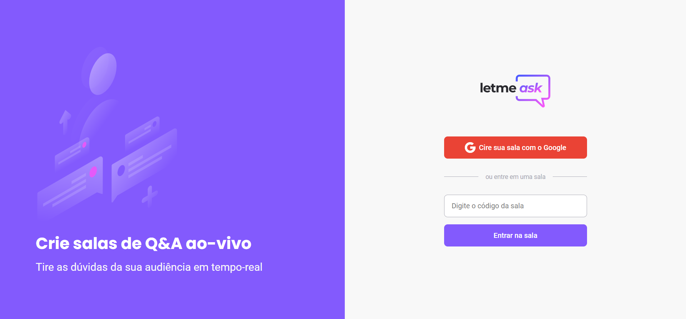

<h1 align="center">
  
</h1>

 

  

## ✨ Tecnologias

Esse projeto foi desenvolvido com as seguintes tecnologias:

- [React](https://reactjs.org)
- [TypeScript](https://www.typescriptlang.org/)

## 💻 Projeto

O LetMeAsk é um app para fazer perguntas, para ser mais especifico, para produtores de conteúdos áudio visuais que recebe varias perguntas ao mesmo tempo, este app vai organizar essas perguntas feitas em uma sala criada onde o administrador pode marca-las como respondidas e os usuários podem ranqueá-las para ter uma maior atenção do administrador.

## 🚀 Como executar

- Clone o repositório
- Instale as dependências com `yarn`
- Inicie o servidor com `yarn start`

Agora você pode acessar [`localhost:3000`](http://localhost:3000) do seu navegador.

---

Feito com ♥ by Douglas 👋🏻
